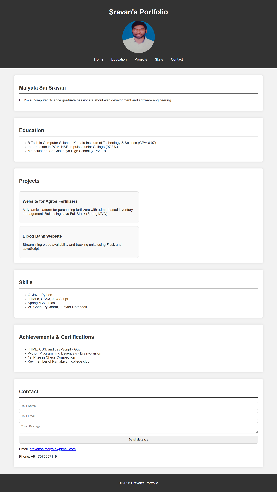

# Portfolio Website



## 🌟 About the Project
This is a personal portfolio website built using **HTML, CSS, and JavaScript**. It showcases my skills, projects, and contact information in a visually appealing and interactive way.

## 🚀 Features
- Smooth scrolling and animations
- Interactive project showcase
- Contact form for inquiries

## 🛠️ Technologies Used
- **HTML** for structuring the content
- **CSS** for styling and layout
- **JavaScript** for interactivity like smooth scrolling

## 📂 Project Structure

## 📥 Installation & Setup
1. **Clone the repository:**
   ```bash
   git clone https://github.com/your-username/portfolio-website.git
  ```
  ```bash
   cd portfolio-website
  ```
